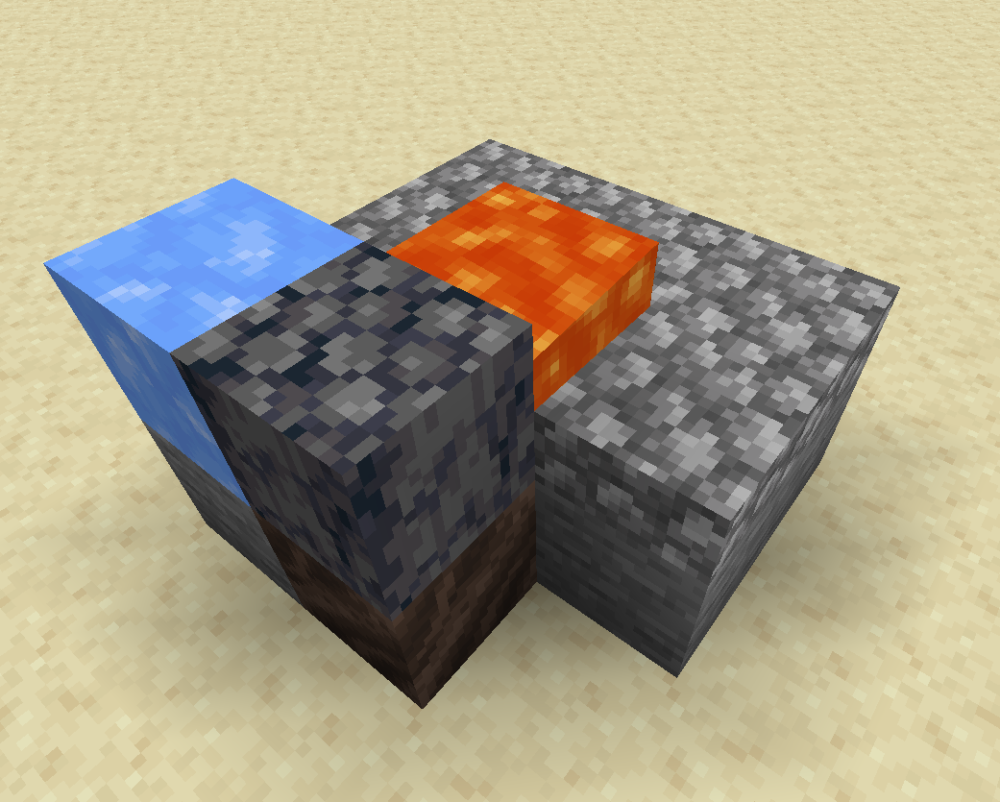
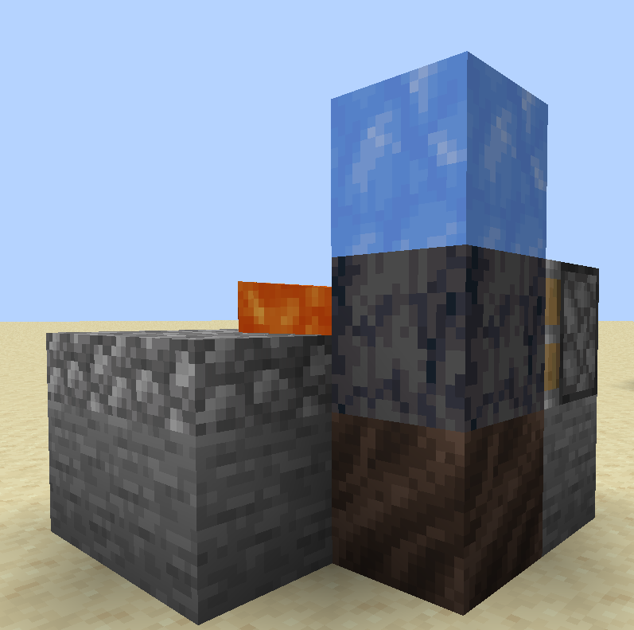
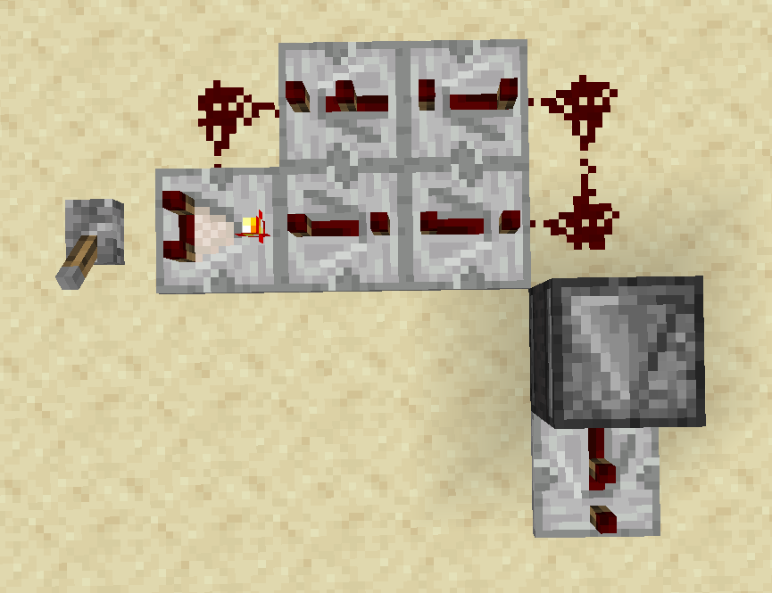

Es gibt 2 Formen von Generatoren: Den Overworld- und den Nether-Generator. Wie man sie baut ist in den folgenden Abbildungen zu sehen.

=== "Bruchstein-Generator"
    !!! note ""
        Der Bruchstein-Generator ist ein Bruchsteingenerator und produziert primär Resourcen, die man auch in der Overworld finden kann.
    
=== "Nether-Generator"
    !!! note ""
        Der Nether-Generator ein Basalt Generator und produziert primär Resourcen, die man auch im Nether finden kann. 
    
=== "Deepslate-Generator"
    !!! note ""
        Wird der Bruchstein-Generator unter Höhe 0 errichtet, so produziert er Deepslate und Deepslate Erze und ähnliches. Zudem ist die Chance für Diamanterz größer.
    

Der Stein-Generator wird nicht beeinflusst und kann so genutzt werden um Stein und Bruchstein zum Bauen zu produzieren, wenn man das möchte.

## Automatisierung
Um weniger Resourcen zu verlieren bietet es sich an, den Generator so zu automatisieren, das die Erze nicht so einfach verbrennen. Das kann man erreichen, indem man einen Trichter direkt unter den Generator platziert oder die generierten Blöcke mit einem Kolben herausschiebt. Bei der Variante mit dem Trichter verbrennen jedoch immernoch Items von Zeit zu Zeit. Zudem ist das nicht für den Nether-Generator anwendbar. Eine mögliche Anordnung eines Kolbens für die Generatoren ist unten zu sehen.

=== "Overworld Generator automatisiert"
    
=== "Nether Generator automatisiert"
    
    
### Die Clock
Wie schnell ein Clock ideal ticken muss, lässt sich ausrechnen. Dafür muss man wissen, wie schnell Lava fließt. Eine möglich Quelle für solche Informationen kann das Minecraft-Wiki sein. Hier findet sich ein Wert von 30 Ticks pro Block. Da wir mit Redstone arbeiten wollen, müssen wird das in Redstoneticks umwandeln. Hierzwischen liegt ein Faktor von 2, es sind als 15 Redstone-Ticks. Bei einer Comperator-Clock müss ein Tick für den Comperator abgezogen werden, es bleiben also 14 Ticks über. Teilt man nun durch die 4 Ticks die ein Redstone-Verstärker bietet, ergibt sich ein Wert von 3 mit dem Rest 2. Wir brauchen also 4 Verstärker, 3 davon auf Verzögerung 4 und einen auf Verzögerung 2. Ein möglicher Aufbau ist auf dem Bild zu sehen.

=== "Redstone Clock"
    
    
## Ein Auszug
Baut man das ganze Größer lässt sich ein Auszug des Generators erstellen. Im Spiel kann man das nutzen, um Erze einfacher herauszusuchen. Allgemein ist es aber hilfreich um einen Überblick über die Generierten Blöcke zu erhalten. Auf dem Bild ist ein Lvl 26 Generator Auszug zu sehen: Links für den Nether, rechts für die Overworld.

=== "Auszug"
    
    
## Aktueller Status des Generators
Um Infos zum Generator zu erhalten gibt es 2 Commands:

 - /is ore - Gibt einem Informationen über die Erzzusammensetzung auf dem aktuellen Level
 - /is generator - Gibt einem Information über das aktuelle Generator Level

(Stand 24.02.2022)
